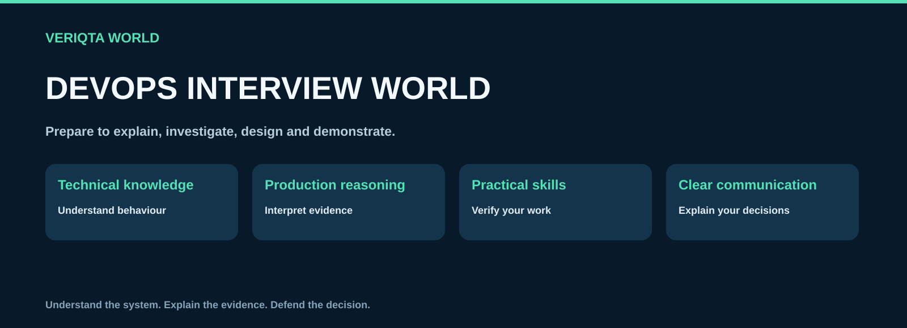
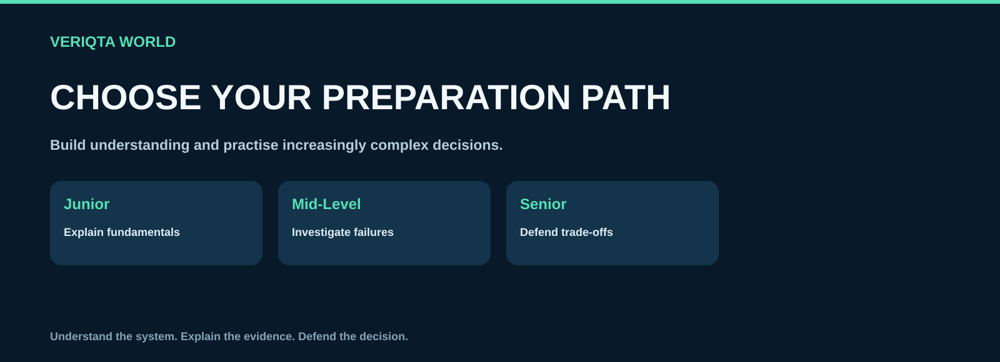
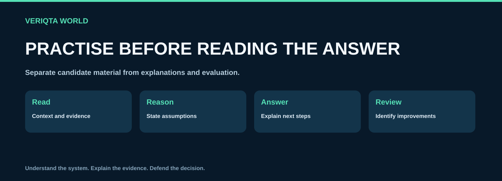
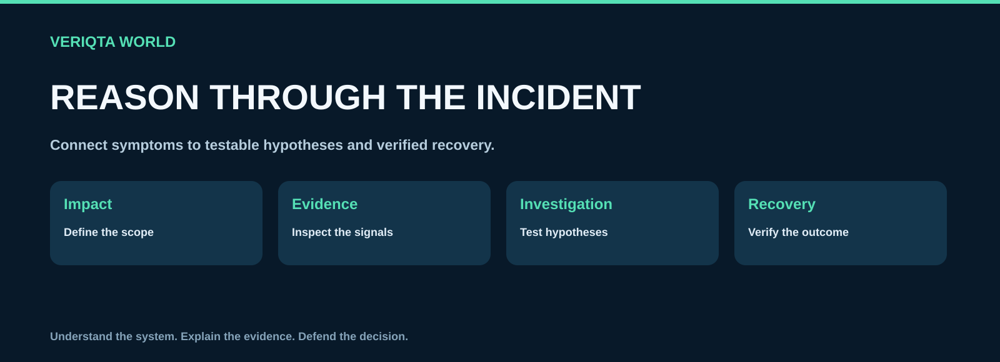
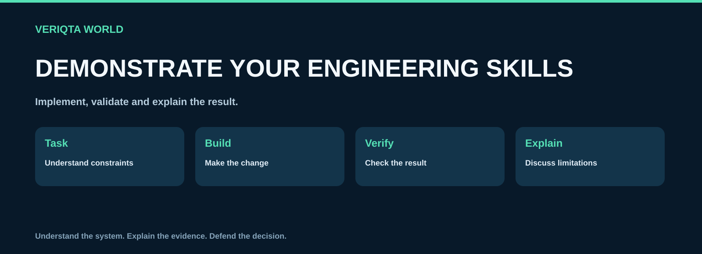
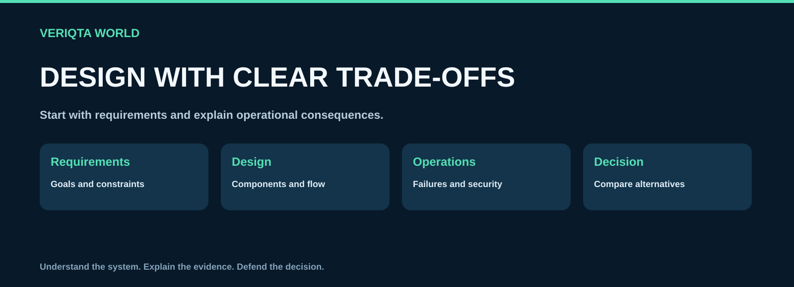
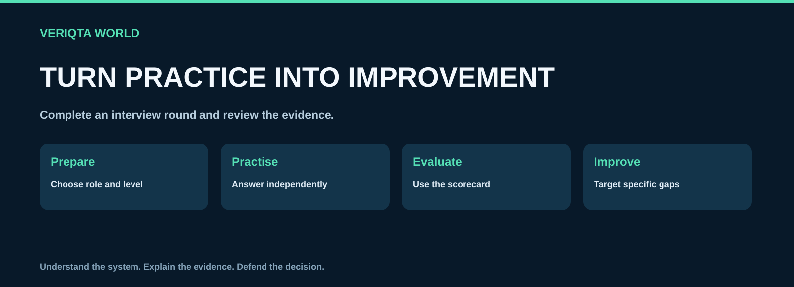

# DEVOPS-INTERVIEW-WORLD

**Technical questions, production scenarios and practical interview preparation for DevOps, Cloud, SRE and Platform Engineers.**

[Start here](00-start-here) · [Topic questions](02-topic-questions) · [Production scenarios](03-production-scenarios) · [Hands-on assessments](05-hands-on-assessments) · [Mock interviews](09-mock-interviews)

DEVOPS-INTERVIEW-WORLD connects technical understanding with the ability to explain decisions, investigate failures and demonstrate practical engineering skills. Explore questions, separate answer guides, evidence-driven scenarios, architecture discussions, practical assessments and complete mock interviews.

## Explore the repository

| Collection | Preparation focus |
| --- | --- |
| [Start here](00-start-here) | Choose your preparation path, level and practice format. |
| [Interview guides](01-interview-guides) | Prepare clear technical explanations and evidence-based answers. |
| [Topic questions](02-topic-questions) | Practise technical questions with separate answer explanations. |
| [Production scenarios](03-production-scenarios) | Reason through realistic incidents, uncertainty and trade-offs. |
| [Troubleshooting interviews](04-troubleshooting-interviews) | Interpret symptoms and evidence to select useful diagnostic steps. |
| [Hands-on assessments](05-hands-on-assessments) | Demonstrate practical skills through reproducible engineering tasks. |
| [Architecture and system design](06-architecture-and-system-design) | Explain system requirements, design choices and operational trade-offs. |
| [Role-based interviews](07-role-based-interviews) | Prepare for DevOps, Cloud, SRE and Platform Engineer responsibilities. |
| [Behavioural and experience](08-behavioural-and-experience) | Explain ownership, collaboration, incidents and your own engineering work. |
| [Mock interviews](09-mock-interviews) | Practise complete interview rounds with separate candidate and interviewer material. |
| [Study plans and checklists](10-study-plans-and-checklists) | Plan preparation, review skill gaps and assess readiness. |

## Choose your preparation path

| Level | Focus |
| --- | --- |
| Junior | Explain fundamentals, read commands and configurations, and complete bounded practical tasks |
| Mid-Level | Investigate failures, interpret operational evidence and explain change decisions |
| Senior | Evaluate architecture, uncertainty, reliability, security and operational trade-offs |

Choose your role and review the skills it requires. Use question-level guidance and follow-up prompts to select an appropriate challenge. Difficulty reflects reasoning and system complexity, not obscure terminology.

## Practise before opening the answer

Read the question or candidate brief, state your assumptions and explain your reasoning. Record your answer before opening the separate explanation. Compare your investigation, technical accuracy and trade-offs with the evaluation guidance, then practise the areas you missed.

## Production reasoning

Scenarios connect system context, symptoms, recent changes and operational evidence. Explain what the evidence supports, what remains uncertain and which check you would perform next. When a root cause is not established, distinguish a hypothesis from a conclusion. Discuss mitigation, risk and verification of recovery.

[Explore production scenarios](03-production-scenarios) · [Practise troubleshooting](04-troubleshooting-interviews)

## Demonstrate practical skills

Complete practical tasks before using hints or solutions. Validate your result and explain how you tested it. Practise in isolated environments and clean up resources after cloud or infrastructure exercises.

[Explore hands-on assessments](05-hands-on-assessments)

## Explain architecture decisions

Clarify requirements, propose a design and explain how it behaves under failure, load and change. Compare alternatives and discuss security, observability, recovery and cost.

[Explore architecture interviews](06-architecture-and-system-design)

## Prepare for your target role

- [DevOps Engineer](07-role-based-interviews/devops-engineer)
- [Cloud Engineer](07-role-based-interviews/cloud-engineer)
- [SRE](07-role-based-interviews/sre)
- [Platform Engineer](07-role-based-interviews/platform-engineer)

Use behavioural and portfolio discussions to explain work you actually performed. Distinguish guided projects, independent improvements and professional experience. Support claims with examples and measured results.

## Complete a mock interview

Choose a role and level. Follow the interview plan using candidate questions, then review the interviewer guide and scorecard. Turn feedback into a focused improvement plan.

[Explore mock interviews](09-mock-interviews) · [Review study plans and checklists](10-study-plans-and-checklists)

## Contribute

Contribute original questions, technically grounded explanations, reproducible practical tasks and realistic evidence. Keep questions separate from answers and make evaluation criteria explicit.

[Read the contribution guide](CONTRIBUTING.md) · [Review the content standard](CONTENT-STANDARD.md)

## About VERIQTA WORLD

VERIQTA WORLD shares engineering resources that connect learning with practical work.

[Explore VERIQTA WORLD](https://github.com/VERIQTA-WORLD)

These educational questions do not claim to reproduce confidential employer interviews or certification exams. Preparation does not guarantee an interview or employment. Product names belong to their respective owners.
