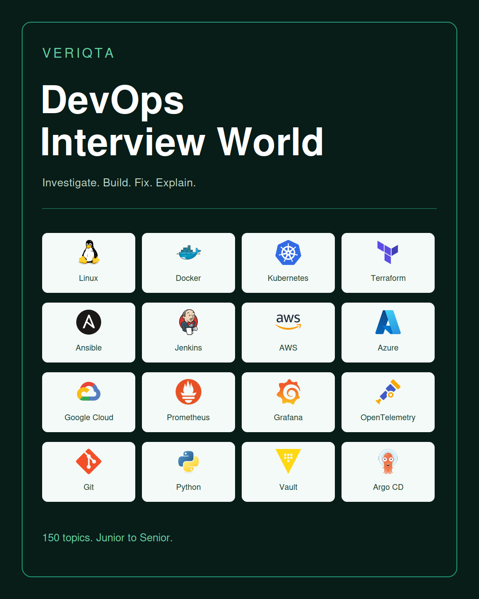
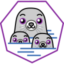
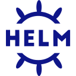

# DevOps Interview World

### Practical interviews. Clear reasoning. Verified recovery.

**DevOps, SRE, Cloud, and Platform Engineering interview preparation by VERIQTA.**

Prepare to investigate systems, diagnose failures, and explain engineering decisions. Explore Linux, networking, containers, Kubernetes, cloud platforms, infrastructure as code, delivery pipelines, security, and observability.

**Publication status:** This edition provides the catalogue and repository structure. Exercise files are intentionally empty while their labs and worked solutions are developed. Video and online practice links will be added when available.

## Find your starting point

| Interview target | Recommended focus |
|---|---|
| Junior DevOps | Linux, networking, Git, Bash, Docker |
| DevOps Engineer | Containers, CI/CD, infrastructure as code, cloud |
| SRE | Observability, Kubernetes, incident investigation, recovery |
| Platform Engineer | Kubernetes, GitOps, automation, identity, infrastructure |
| Senior Engineer | Cross-system diagnosis, tradeoffs, risk, prevention |

## Technology directory

Each tool appears once in this directory. Select a tool to open its folder.

| Tool | Category | Company or project | Difficulty | Video | Solve Online |
|---|---|---|---|---|---|
| [Linux](questions/tools/linux/) | Foundations |  Linux project or ecosystem | Junior to Senior | Pending | Pending |
| [Bash](questions/tools/bash/) | Foundations |  Bash project or ecosystem | Junior to Senior | Pending | Pending |
| [Git](questions/tools/git/) | Foundations |  Git project or ecosystem | Junior to Senior | Pending | Pending |
| [GitHub](questions/tools/github/) | Foundations |  GitHub | Junior to Senior | Pending | Pending |
| [Python](questions/tools/python/) | Foundations |  Python project or ecosystem | Junior to Senior | Pending | Pending |
| [Go](questions/tools/go/) | Foundations |  Go project or ecosystem | Junior to Senior | Pending | Pending |
| [NGINX](questions/tools/nginx/) | Foundations |  NGINX project or ecosystem | Junior to Senior | Pending | Pending |
| [Docker](questions/tools/docker/) | Containers |  Docker | Junior to Senior | Pending | Pending |
| [Podman](questions/tools/podman/) | Containers |  Podman project | Junior to Senior | Pending | Pending |
| [containerd](questions/tools/containerd/) | Containers |  containerd project or ecosystem | Junior to Senior | Pending | Pending |
| [CRI-O](questions/tools/crio/) | Containers |  CRI-O project or ecosystem | Junior to Senior | Pending | Pending |
| [BuildKit](questions/tools/buildkit/) | Containers |  BuildKit project or ecosystem | Junior to Senior | Pending | Pending |
| [Docker Compose](questions/tools/compose/) | Containers |  Docker Compose project or ecosystem | Junior to Senior | Pending | Pending |
| [Kubernetes](questions/tools/kubernetes/) | Kubernetes |  Kubernetes project | Junior to Senior | Pending | Pending |
| [Helm](questions/tools/helm/) | Kubernetes |  Helm project or ecosystem | Junior to Senior | Pending | Pending |
| [Kustomize](questions/tools/kustomize/) | Kubernetes |  Kustomize project or ecosystem | Junior to Senior | Pending | Pending |
| [Terraform](questions/tools/terraform/) | Infrastructure |  HashiCorp | Junior to Senior | Pending | Pending |
| [OpenTofu](questions/tools/opentofu/) | Infrastructure |  OpenTofu project or ecosystem | Junior to Senior | Pending | Pending |
| [Ansible](questions/tools/ansible/) | Infrastructure |  Ansible project or ecosystem | Junior to Senior | Pending | Pending |
| [CloudFormation](questions/tools/cloudformation/) | Infrastructure |  CloudFormation project or ecosystem | Junior to Senior | Pending | Pending |
| [Jenkins](questions/tools/jenkins/) | Delivery |  Jenkins project | Junior to Senior | Pending | Pending |
| [GitHub Actions](questions/tools/githubactions/) | Delivery |  GitHub | Junior to Senior | Pending | Pending |
| [GitLab](questions/tools/gitlab/) | Delivery |  GitLab | Junior to Senior | Pending | Pending |
| [Azure DevOps](questions/tools/azuredevops/) | Delivery |  Microsoft | Junior to Senior | Pending | Pending |
| [Argo CD](questions/tools/argocd/) | Delivery |  Argo CD project or ecosystem | Junior to Senior | Pending | Pending |
| [Flux](questions/tools/flux/) | Delivery |  Flux project or ecosystem | Junior to Senior | Pending | Pending |
| [AWS](questions/tools/amazonwebservices/) | Cloud |  Amazon Web Services | Junior to Senior | Pending | Pending |
| [Azure](questions/tools/azure/) | Cloud |  Microsoft | Junior to Senior | Pending | Pending |
| [Google Cloud](questions/tools/googlecloud/) | Cloud |  Google | Junior to Senior | Pending | Pending |
| [Docker Hub](questions/tools/dockerhub/) | Cloud |  Docker Hub project or ecosystem | Junior to Senior | Pending | Pending |
| [Amazon ECR](questions/tools/ecr/) | Cloud |  Amazon ECR project or ecosystem | Junior to Senior | Pending | Pending |
| [Azure ACR](questions/tools/acr/) | Cloud |  Azure ACR project or ecosystem | Junior to Senior | Pending | Pending |
| [Artifact Registry](questions/tools/artifactregistry/) | Cloud |  Artifact Registry project or ecosystem | Junior to Senior | Pending | Pending |
| [Prometheus](questions/tools/prometheus/) | Metrics and logs |  Prometheus project or ecosystem | Junior to Senior | Pending | Pending |
| [Grafana](questions/tools/grafana/) | Metrics and logs |  Grafana Labs | Junior to Senior | Pending | Pending |
| [Loki](questions/tools/loki/) | Metrics and logs |  Grafana Labs | Junior to Senior | Pending | Pending |
| [Fluent Bit](questions/tools/fluentbit/) | Metrics and logs |  Fluent Bit project or ecosystem | Junior to Senior | Pending | Pending |
| [Fluentd](questions/tools/fluentd/) | Metrics and logs |  Fluentd project or ecosystem | Junior to Senior | Pending | Pending |
| [Elasticsearch](questions/tools/elasticsearch/) | Metrics and logs |  Elasticsearch project or ecosystem | Junior to Senior | Pending | Pending |
| [Logstash](questions/tools/logstash/) | Metrics and logs |  Logstash project or ecosystem | Junior to Senior | Pending | Pending |
| [Kibana](questions/tools/kibana/) | Metrics and logs |  Kibana project or ecosystem | Junior to Senior | Pending | Pending |
| [OpenSearch](questions/tools/opensearch/) | Metrics and logs |  OpenSearch project or ecosystem | Junior to Senior | Pending | Pending |
| [Splunk](questions/tools/splunk/) | Metrics and logs |  Splunk project or ecosystem | Junior to Senior | Pending | Pending |
| [OpenTelemetry](questions/tools/opentelemetry/) | Tracing and alerts |  OpenTelemetry project or ecosystem | Junior to Senior | Pending | Pending |
| [Jaeger](questions/tools/jaeger/) | Tracing and alerts |  Jaeger project or ecosystem | Junior to Senior | Pending | Pending |
| [Tempo](questions/tools/tempo/) | Tracing and alerts |  Grafana Labs | Junior to Senior | Pending | Pending |
| [Alertmanager](questions/tools/alertmanager/) | Tracing and alerts |  Alertmanager project or ecosystem | Junior to Senior | Pending | Pending |
| [CloudWatch](questions/tools/cloudwatch/) | Cloud telemetry |  CloudWatch project or ecosystem | Junior to Senior | Pending | Pending |
| [Azure Monitor](questions/tools/azuremonitor/) | Cloud telemetry |  Azure Monitor project or ecosystem | Junior to Senior | Pending | Pending |
| [Cloud Monitoring](questions/tools/googlecloudmonitoring/) | Cloud telemetry |  Cloud Monitoring project or ecosystem | Junior to Senior | Pending | Pending |
| [Datadog](questions/tools/datadog/) | Cloud telemetry |  Datadog | Junior to Senior | Pending | Pending |
| [New Relic](questions/tools/newrelic/) | Cloud telemetry |  New Relic | Junior to Senior | Pending | Pending |
| [Vault](questions/tools/vault/) | Security |  HashiCorp | Junior to Senior | Pending | Pending |
| [Trivy](questions/tools/trivy/) | Security |  Trivy project or ecosystem | Junior to Senior | Pending | Pending |

## Interview question catalogue

The titles below link to reserved exercise files. They are listed for navigation; their content is not yet published.

| # | Question | Category | Difficulty | Exercise | Video | Solve Online |
|---|---|---|---|---|---|---|
| 001 | Diagnose a service that fails after restart | Linux | Junior | [File](questions/linux/DIW-001-diagnose-a-service-that-fails-after-restart.md) | Pending | Pending |
| 002 | Find the largest consumers of disk space | Linux | Junior | [File](questions/linux/DIW-002-find-the-largest-consumers-of-disk-space.md) | Pending | Pending |
| 003 | Recover space held by deleted open files | Linux | Mid-Level | [File](questions/linux/DIW-003-recover-space-held-by-deleted-open-files.md) | Pending | Pending |
| 004 | Investigate memory pressure without an OOM event | Linux | Mid-Level | [File](questions/linux/DIW-004-investigate-memory-pressure-without-an-oom-event.md) | Pending | Pending |
| 005 | Diagnose high load with low CPU usage | Linux | Senior | [File](questions/linux/DIW-005-diagnose-high-load-with-low-cpu-usage.md) | Pending | Pending |
| 006 | Recover a service affected by file descriptor exhaustion | Linux | Senior | [File](questions/linux/DIW-006-recover-a-service-affected-by-file-descriptor-exhaustion.md) | Pending | Pending |
| 007 | Handle command failures and exit codes | Bash | Junior | [File](questions/bash/DIW-007-handle-command-failures-and-exit-codes.md) | Pending | Pending |
| 008 | Validate script arguments and input | Bash | Junior | [File](questions/bash/DIW-008-validate-script-arguments-and-input.md) | Pending | Pending |
| 009 | Preserve failure status across pipelines | Bash | Mid-Level | [File](questions/bash/DIW-009-preserve-failure-status-across-pipelines.md) | Pending | Pending |
| 010 | Prevent overlapping scheduled script runs | Bash | Mid-Level | [File](questions/bash/DIW-010-prevent-overlapping-scheduled-script-runs.md) | Pending | Pending |
| 011 | Make a deployment script recover from partial failure | Bash | Senior | [File](questions/bash/DIW-011-make-a-deployment-script-recover-from-partial-failure.md) | Pending | Pending |
| 012 | Design reliable backup validation and retention | Bash | Senior | [File](questions/bash/DIW-012-design-reliable-backup-validation-and-retention.md) | Pending | Pending |
| 013 | Recover a commit after reset | Git | Junior | [File](questions/git/DIW-013-recover-a-commit-after-reset.md) | Pending | Pending |
| 014 | Resolve and verify a merge conflict | Git | Junior | [File](questions/git/DIW-014-resolve-and-verify-a-merge-conflict.md) | Pending | Pending |
| 015 | Apply a hotfix while preserving unfinished work | Git | Mid-Level | [File](questions/git/DIW-015-apply-a-hotfix-while-preserving-unfinished-work.md) | Pending | Pending |
| 016 | Recover from an incorrect rebase | Git | Mid-Level | [File](questions/git/DIW-016-recover-from-an-incorrect-rebase.md) | Pending | Pending |
| 017 | Remove an exposed secret and complete remediation | Git | Senior | [File](questions/git/DIW-017-remove-an-exposed-secret-and-complete-remediation.md) | Pending | Pending |
| 018 | Recover a release after an incorrect history rewrite | Git | Senior | [File](questions/git/DIW-018-recover-a-release-after-an-incorrect-history-rewrite.md) | Pending | Pending |
| 019 | Diagnose hostname failure when IP access works | Networking | Junior | [File](questions/networking/DIW-019-diagnose-hostname-failure-when-ip-access-works.md) | Pending | Pending |
| 020 | Identify the process listening on a port | Networking | Junior | [File](questions/networking/DIW-020-identify-the-process-listening-on-a-port.md) | Pending | Pending |
| 021 | Trace a connection blocked by routing or firewall rules | Networking | Mid-Level | [File](questions/networking/DIW-021-trace-a-connection-blocked-by-routing-or-firewall-rules.md) | Pending | Pending |
| 022 | Diagnose TLS certificate chain failures | Networking | Mid-Level | [File](questions/networking/DIW-022-diagnose-tls-certificate-chain-failures.md) | Pending | Pending |
| 023 | Investigate intermittent reverse proxy 502 responses | Networking | Senior | [File](questions/networking/DIW-023-investigate-intermittent-reverse-proxy-502-responses.md) | Pending | Pending |
| 024 | Diagnose packet loss across application dependencies | Networking | Senior | [File](questions/networking/DIW-024-diagnose-packet-loss-across-application-dependencies.md) | Pending | Pending |
| 025 | Diagnose a container that exits immediately | Docker | Junior | [File](questions/containers/docker/DIW-025-diagnose-a-container-that-exits-immediately.md) | Pending | Pending |
| 026 | Fix container access to a mounted file | Docker | Junior | [File](questions/containers/docker/DIW-026-fix-container-access-to-a-mounted-file.md) | Pending | Pending |
| 027 | Restore communication between Compose services | Docker | Mid-Level | [File](questions/containers/docker/DIW-027-restore-communication-between-compose-services.md) | Pending | Pending |
| 028 | Diagnose container memory termination | Docker | Mid-Level | [File](questions/containers/docker/DIW-028-diagnose-container-memory-termination.md) | Pending | Pending |
| 029 | Recover an application with incorrect signal handling | Docker | Senior | [File](questions/containers/docker/DIW-029-recover-an-application-with-incorrect-signal-handling.md) | Pending | Pending |
| 030 | Investigate CPU throttling and application latency | Docker | Senior | [File](questions/containers/docker/DIW-030-investigate-cpu-throttling-and-application-latency.md) | Pending | Pending |
| 031 | Fix an incorrect Docker build context | Builds and registries | Junior | [File](questions/containers/builds-and-registries/DIW-031-fix-an-incorrect-docker-build-context.md) | Pending | Pending |
| 032 | Tag and verify an image by commit SHA | Builds and registries | Junior | [File](questions/containers/builds-and-registries/DIW-032-tag-and-verify-an-image-by-commit-sha.md) | Pending | Pending |
| 033 | Build and test AMD64 and ARM64 images | Builds and registries | Mid-Level | [File](questions/containers/builds-and-registries/DIW-033-build-and-test-amd64-and-arm64-images.md) | Pending | Pending |
| 034 | Diagnose registry push and pull authentication | Builds and registries | Mid-Level | [File](questions/containers/builds-and-registries/DIW-034-diagnose-registry-push-and-pull-authentication.md) | Pending | Pending |
| 035 | Trace stale image deployment despite a successful build | Builds and registries | Senior | [File](questions/containers/builds-and-registries/DIW-035-trace-stale-image-deployment-despite-a-successful-build.md) | Pending | Pending |
| 036 | Secure build credentials and verify they are absent from image layers | Builds and registries | Senior | [File](questions/containers/builds-and-registries/DIW-036-secure-build-credentials-and-verify-they-are-absent-from-image-layers.md) | Pending | Pending |
| 037 | Run and inspect a rootless Podman container | Podman and runtimes | Junior | [File](questions/containers/runtimes/DIW-037-run-and-inspect-a-rootless-podman-container.md) | Pending | Pending |
| 038 | Diagnose rootless bind mount ownership | Podman and runtimes | Junior | [File](questions/containers/runtimes/DIW-038-diagnose-rootless-bind-mount-ownership.md) | Pending | Pending |
| 039 | Repair Podman container network connectivity | Podman and runtimes | Mid-Level | [File](questions/containers/runtimes/DIW-039-repair-podman-container-network-connectivity.md) | Pending | Pending |
| 040 | Investigate runtime image and container state with crictl | Podman and runtimes | Mid-Level | [File](questions/containers/runtimes/DIW-040-investigate-runtime-image-and-container-state-with-crictl.md) | Pending | Pending |
| 041 | Diagnose a node runtime failure using containerd evidence | Podman and runtimes | Senior | [File](questions/containers/runtimes/DIW-041-diagnose-a-node-runtime-failure-using-containerd-evidence.md) | Pending | Pending |
| 042 | Diagnose a node runtime failure using CRI-O evidence | Podman and runtimes | Senior | [File](questions/containers/runtimes/DIW-042-diagnose-a-node-runtime-failure-using-cri-o-evidence.md) | Pending | Pending |
| 043 | Diagnose CrashLoopBackOff | Kubernetes workloads | Junior | [File](questions/kubernetes/workloads/DIW-043-diagnose-crashloopbackoff.md) | Pending | Pending |
| 044 | Fix a Pod with invalid configuration | Kubernetes workloads | Junior | [File](questions/kubernetes/workloads/DIW-044-fix-a-pod-with-invalid-configuration.md) | Pending | Pending |
| 045 | Investigate ImagePullBackOff | Kubernetes workloads | Mid-Level | [File](questions/kubernetes/workloads/DIW-045-investigate-imagepullbackoff.md) | Pending | Pending |
| 046 | Diagnose an unschedulable Pod | Kubernetes workloads | Mid-Level | [File](questions/kubernetes/workloads/DIW-046-diagnose-an-unschedulable-pod.md) | Pending | Pending |
| 047 | Recover a rollout blocked by readiness failures | Kubernetes workloads | Senior | [File](questions/kubernetes/workloads/DIW-047-recover-a-rollout-blocked-by-readiness-failures.md) | Pending | Pending |
| 048 | Investigate intermittent OOM kills during traffic spikes | Kubernetes workloads | Senior | [File](questions/kubernetes/workloads/DIW-048-investigate-intermittent-oom-kills-during-traffic-spikes.md) | Pending | Pending |
| 049 | Find why a Service has no endpoints | Kubernetes platform | Junior | [File](questions/kubernetes/platform/DIW-049-find-why-a-service-has-no-endpoints.md) | Pending | Pending |
| 050 | Grant read-only namespace access | Kubernetes platform | Junior | [File](questions/kubernetes/platform/DIW-050-grant-read-only-namespace-access.md) | Pending | Pending |
| 051 | Diagnose a PersistentVolumeClaim that remains Pending | Kubernetes platform | Mid-Level | [File](questions/kubernetes/platform/DIW-051-diagnose-a-persistentvolumeclaim-that-remains-pending.md) | Pending | Pending |
| 052 | Restore cluster DNS resolution | Kubernetes platform | Mid-Level | [File](questions/kubernetes/platform/DIW-052-restore-cluster-dns-resolution.md) | Pending | Pending |
| 053 | Investigate ingress failure across network boundaries | Kubernetes platform | Senior | [File](questions/kubernetes/platform/DIW-053-investigate-ingress-failure-across-network-boundaries.md) | Pending | Pending |
| 054 | Diagnose node pressure and workload eviction | Kubernetes platform | Senior | [File](questions/kubernetes/platform/DIW-054-diagnose-node-pressure-and-workload-eviction.md) | Pending | Pending |
| 055 | Render and inspect a Helm chart | Helm and Kustomize | Junior | [File](questions/kubernetes/configuration/DIW-055-render-and-inspect-a-helm-chart.md) | Pending | Pending |
| 056 | Build and compare Kustomize overlays | Helm and Kustomize | Junior | [File](questions/kubernetes/configuration/DIW-056-build-and-compare-kustomize-overlays.md) | Pending | Pending |
| 057 | Fix incorrect Helm values precedence | Helm and Kustomize | Mid-Level | [File](questions/kubernetes/configuration/DIW-057-fix-incorrect-helm-values-precedence.md) | Pending | Pending |
| 058 | Repair a Kustomize patch that targets the wrong resource | Helm and Kustomize | Mid-Level | [File](questions/kubernetes/configuration/DIW-058-repair-a-kustomize-patch-that-targets-the-wrong-resource.md) | Pending | Pending |
| 059 | Recover a failed Helm upgrade with persistent data constraints | Helm and Kustomize | Senior | [File](questions/kubernetes/configuration/DIW-059-recover-a-failed-helm-upgrade-with-persistent-data-constraints.md) | Pending | Pending |
| 060 | Investigate configuration drift across release environments | Helm and Kustomize | Senior | [File](questions/kubernetes/configuration/DIW-060-investigate-configuration-drift-across-release-environments.md) | Pending | Pending |
| 061 | Diagnose S3 access denied for a workload | AWS foundations | Junior | [File](questions/cloud/aws/foundations/DIW-061-diagnose-s3-access-denied-for-a-workload.md) | Pending | Pending |
| 062 | Verify DNS records in a Route 53 hosted zone | AWS foundations | Junior | [File](questions/cloud/aws/foundations/DIW-062-verify-dns-records-in-a-route-53-hosted-zone.md) | Pending | Pending |
| 063 | Restore private subnet outbound access through NAT | AWS foundations | Mid-Level | [File](questions/cloud/aws/foundations/DIW-063-restore-private-subnet-outbound-access-through-nat.md) | Pending | Pending |
| 064 | Diagnose an EC2 instance unreachable through its intended access path | AWS foundations | Mid-Level | [File](questions/cloud/aws/foundations/DIW-064-diagnose-an-ec2-instance-unreachable-through-its-intended-access-path.md) | Pending | Pending |
| 065 | Investigate conflicting IAM policy decisions | AWS foundations | Senior | [File](questions/cloud/aws/foundations/DIW-065-investigate-conflicting-iam-policy-decisions.md) | Pending | Pending |
| 066 | Design least-privilege access and verify allowed and denied operations | AWS foundations | Senior | [File](questions/cloud/aws/foundations/DIW-066-design-least-privilege-access-and-verify-allowed-and-denied-operations.md) | Pending | Pending |
| 067 | Deploy and invoke a Lambda function | AWS applications | Junior | [File](questions/cloud/aws/applications/DIW-067-deploy-and-invoke-a-lambda-function.md) | Pending | Pending |
| 068 | Investigate an API Gateway request failure | AWS applications | Junior | [File](questions/cloud/aws/applications/DIW-068-investigate-an-api-gateway-request-failure.md) | Pending | Pending |
| 069 | Diagnose unhealthy ALB targets | AWS applications | Mid-Level | [File](questions/cloud/aws/applications/DIW-069-diagnose-unhealthy-alb-targets.md) | Pending | Pending |
| 070 | Repair Lambda access to DynamoDB | AWS applications | Mid-Level | [File](questions/cloud/aws/applications/DIW-070-repair-lambda-access-to-dynamodb.md) | Pending | Pending |
| 071 | Investigate a private application across VPC ALB and DNS boundaries | AWS applications | Senior | [File](questions/cloud/aws/applications/DIW-071-investigate-a-private-application-across-vpc-alb-and-dns-boundaries.md) | Pending | Pending |
| 072 | Diagnose EKS workload identity and cloud access failures | AWS applications | Senior | [File](questions/cloud/aws/applications/DIW-072-diagnose-eks-workload-identity-and-cloud-access-failures.md) | Pending | Pending |
| 073 | Diagnose a VM connection failure | Azure | Junior | [File](questions/cloud/azure/DIW-073-diagnose-a-vm-connection-failure.md) | Pending | Pending |
| 074 | Verify a managed identity resource assignment | Azure | Junior | [File](questions/cloud/azure/DIW-074-verify-a-managed-identity-resource-assignment.md) | Pending | Pending |
| 075 | Repair AKS image pulls from ACR | Azure | Mid-Level | [File](questions/cloud/azure/DIW-075-repair-aks-image-pulls-from-acr.md) | Pending | Pending |
| 076 | Investigate Azure private DNS resolution | Azure | Mid-Level | [File](questions/cloud/azure/DIW-076-investigate-azure-private-dns-resolution.md) | Pending | Pending |
| 077 | Trace an application failure across Azure load balancing and networking | Azure | Senior | [File](questions/cloud/azure/DIW-077-trace-an-application-failure-across-azure-load-balancing-and-networking.md) | Pending | Pending |
| 078 | Diagnose AKS access to a private Azure dependency | Azure | Senior | [File](questions/cloud/azure/DIW-078-diagnose-aks-access-to-a-private-azure-dependency.md) | Pending | Pending |
| 079 | Diagnose Compute Engine connectivity | Google Cloud | Junior | [File](questions/cloud/gcp/DIW-079-diagnose-compute-engine-connectivity.md) | Pending | Pending |
| 080 | Inspect Artifact Registry access | Google Cloud | Junior | [File](questions/cloud/gcp/DIW-080-inspect-artifact-registry-access.md) | Pending | Pending |
| 081 | Repair a Cloud Run startup failure | Google Cloud | Mid-Level | [File](questions/cloud/gcp/DIW-081-repair-a-cloud-run-startup-failure.md) | Pending | Pending |
| 082 | Investigate GKE workload access to a cloud service | Google Cloud | Mid-Level | [File](questions/cloud/gcp/DIW-082-investigate-gke-workload-access-to-a-cloud-service.md) | Pending | Pending |
| 083 | Trace private Google Cloud application connectivity | Google Cloud | Senior | [File](questions/cloud/gcp/DIW-083-trace-private-google-cloud-application-connectivity.md) | Pending | Pending |
| 084 | Diagnose Cloud Run latency under concurrency and dependency pressure | Google Cloud | Senior | [File](questions/cloud/gcp/DIW-084-diagnose-cloud-run-latency-under-concurrency-and-dependency-pressure.md) | Pending | Pending |
| 085 | Inspect a plan before changing infrastructure | Terraform | Junior | [File](questions/terraform/DIW-085-inspect-a-plan-before-changing-infrastructure.md) | Pending | Pending |
| 086 | Diagnose an invalid variable or provider configuration | Terraform | Junior | [File](questions/terraform/DIW-086-diagnose-an-invalid-variable-or-provider-configuration.md) | Pending | Pending |
| 087 | Investigate drift before applying changes | Terraform | Mid-Level | [File](questions/terraform/DIW-087-investigate-drift-before-applying-changes.md) | Pending | Pending |
| 088 | Recover from a failed partial apply | Terraform | Mid-Level | [File](questions/terraform/DIW-088-recover-from-a-failed-partial-apply.md) | Pending | Pending |
| 089 | Refactor resource addresses without recreation | Terraform | Senior | [File](questions/terraform/DIW-089-refactor-resource-addresses-without-recreation.md) | Pending | Pending |
| 090 | Recover inaccessible state using a documented backend recovery procedure | Terraform | Senior | [File](questions/terraform/DIW-090-recover-inaccessible-state-using-a-documented-backend-recovery-procedure.md) | Pending | Pending |
| 091 | Fix an inventory targeting error | Ansible | Junior | [File](questions/ansible/DIW-091-fix-an-inventory-targeting-error.md) | Pending | Pending |
| 092 | Diagnose privilege escalation failure | Ansible | Junior | [File](questions/ansible/DIW-092-diagnose-privilege-escalation-failure.md) | Pending | Pending |
| 093 | Repair a non-idempotent playbook | Ansible | Mid-Level | [File](questions/ansible/DIW-093-repair-a-non-idempotent-playbook.md) | Pending | Pending |
| 094 | Handle rolling changes with health verification | Ansible | Mid-Level | [File](questions/ansible/DIW-094-handle-rolling-changes-with-health-verification.md) | Pending | Pending |
| 095 | Recover from a partially completed configuration rollout | Ansible | Senior | [File](questions/ansible/DIW-095-recover-from-a-partially-completed-configuration-rollout.md) | Pending | Pending |
| 096 | Prevent secret disclosure through tasks and logs | Ansible | Senior | [File](questions/ansible/DIW-096-prevent-secret-disclosure-through-tasks-and-logs.md) | Pending | Pending |
| 097 | Fix a pipeline syntax error | Jenkins | Junior | [File](questions/ci-cd/jenkins/DIW-097-fix-a-pipeline-syntax-error.md) | Pending | Pending |
| 098 | Diagnose a missing build tool on an agent | Jenkins | Junior | [File](questions/ci-cd/jenkins/DIW-098-diagnose-a-missing-build-tool-on-an-agent.md) | Pending | Pending |
| 099 | Investigate workspace permission failures | Jenkins | Mid-Level | [File](questions/ci-cd/jenkins/DIW-099-investigate-workspace-permission-failures.md) | Pending | Pending |
| 100 | Repair artifact handoff between stages | Jenkins | Mid-Level | [File](questions/ci-cd/jenkins/DIW-100-repair-artifact-handoff-between-stages.md) | Pending | Pending |
| 101 | Diagnose a pipeline that fails only under concurrent builds | Jenkins | Senior | [File](questions/ci-cd/jenkins/DIW-101-diagnose-a-pipeline-that-fails-only-under-concurrent-builds.md) | Pending | Pending |
| 102 | Implement and verify recovery after a failed deployment | Jenkins | Senior | [File](questions/ci-cd/jenkins/DIW-102-implement-and-verify-recovery-after-a-failed-deployment.md) | Pending | Pending |
| 103 | Fix a workflow trigger that does not run | GitHub Actions | Junior | [File](questions/ci-cd/github-actions/DIW-103-fix-a-workflow-trigger-that-does-not-run.md) | Pending | Pending |
| 104 | Preserve useful output from a failing test job | GitHub Actions | Junior | [File](questions/ci-cd/github-actions/DIW-104-preserve-useful-output-from-a-failing-test-job.md) | Pending | Pending |
| 105 | Repair cross-job artifact handoff | GitHub Actions | Mid-Level | [File](questions/ci-cd/github-actions/DIW-105-repair-cross-job-artifact-handoff.md) | Pending | Pending |
| 106 | Diagnose a failing matrix build | GitHub Actions | Mid-Level | [File](questions/ci-cd/github-actions/DIW-106-diagnose-a-failing-matrix-build.md) | Pending | Pending |
| 107 | Secure cloud deployment with scoped OIDC permissions | GitHub Actions | Senior | [File](questions/ci-cd/github-actions/DIW-107-secure-cloud-deployment-with-scoped-oidc-permissions.md) | Pending | Pending |
| 108 | Diagnose deployment races and prevent stale releases | GitHub Actions | Senior | [File](questions/ci-cd/github-actions/DIW-108-diagnose-deployment-races-and-prevent-stale-releases.md) | Pending | Pending |
| 109 | Fix a GitLab job excluded by rules | GitLab and Azure pipelines | Junior | [File](questions/ci-cd/gitlab-and-azure/DIW-109-fix-a-gitlab-job-excluded-by-rules.md) | Pending | Pending |
| 110 | Diagnose an Azure Pipeline agent capability mismatch | GitLab and Azure pipelines | Junior | [File](questions/ci-cd/gitlab-and-azure/DIW-110-diagnose-an-azure-pipeline-agent-capability-mismatch.md) | Pending | Pending |
| 111 | Repair a GitLab deployment image tag | GitLab and Azure pipelines | Mid-Level | [File](questions/ci-cd/gitlab-and-azure/DIW-111-repair-a-gitlab-deployment-image-tag.md) | Pending | Pending |
| 112 | Diagnose Azure environment permissions and approvals | GitLab and Azure pipelines | Mid-Level | [File](questions/ci-cd/gitlab-and-azure/DIW-112-diagnose-azure-environment-permissions-and-approvals.md) | Pending | Pending |
| 113 | Recover a GitLab release with failed verification | GitLab and Azure pipelines | Senior | [File](questions/ci-cd/gitlab-and-azure/DIW-113-recover-a-gitlab-release-with-failed-verification.md) | Pending | Pending |
| 114 | Recover an Azure deployment with failed verification | GitLab and Azure pipelines | Senior | [File](questions/ci-cd/gitlab-and-azure/DIW-114-recover-an-azure-deployment-with-failed-verification.md) | Pending | Pending |
| 115 | Find an Argo CD application sync error | GitOps | Junior | [File](questions/gitops/DIW-115-find-an-argo-cd-application-sync-error.md) | Pending | Pending |
| 116 | Inspect a failed Flux reconciliation | GitOps | Junior | [File](questions/gitops/DIW-116-inspect-a-failed-flux-reconciliation.md) | Pending | Pending |
| 117 | Diagnose repeated Argo CD drift | GitOps | Mid-Level | [File](questions/gitops/DIW-117-diagnose-repeated-argo-cd-drift.md) | Pending | Pending |
| 118 | Repair a Flux source or dependency failure | GitOps | Mid-Level | [File](questions/gitops/DIW-118-repair-a-flux-source-or-dependency-failure.md) | Pending | Pending |
| 119 | Recover a release when automated reconciliation reapplies a bad change | GitOps | Senior | [File](questions/gitops/DIW-119-recover-a-release-when-automated-reconciliation-reapplies-a-bad-change.md) | Pending | Pending |
| 120 | Diagnose conflicting controllers managing the same resource | GitOps | Senior | [File](questions/gitops/DIW-120-diagnose-conflicting-controllers-managing-the-same-resource.md) | Pending | Pending |
| 121 | Restore a missing Prometheus scrape target | Metrics | Junior | [File](questions/observability/metrics/DIW-121-restore-a-missing-prometheus-scrape-target.md) | Pending | Pending |
| 122 | Fix a Grafana data source connection | Metrics | Junior | [File](questions/observability/metrics/DIW-122-fix-a-grafana-data-source-connection.md) | Pending | Pending |
| 123 | Diagnose missing metrics caused by label selection | Metrics | Mid-Level | [File](questions/observability/metrics/DIW-123-diagnose-missing-metrics-caused-by-label-selection.md) | Pending | Pending |
| 124 | Correct a misleading request error rate query | Metrics | Mid-Level | [File](questions/observability/metrics/DIW-124-correct-a-misleading-request-error-rate-query.md) | Pending | Pending |
| 125 | Investigate high metric cardinality and ingestion pressure | Metrics | Senior | [File](questions/observability/metrics/DIW-125-investigate-high-metric-cardinality-and-ingestion-pressure.md) | Pending | Pending |
| 126 | Build and verify an SLO burn rate view from service metrics | Metrics | Senior | [File](questions/observability/metrics/DIW-126-build-and-verify-an-slo-burn-rate-view-from-service-metrics.md) | Pending | Pending |
| 127 | Find logs using service labels and time ranges | Logs | Junior | [File](questions/observability/logs/DIW-127-find-logs-using-service-labels-and-time-ranges.md) | Pending | Pending |
| 128 | Diagnose a log collector permission failure | Logs | Junior | [File](questions/observability/logs/DIW-128-diagnose-a-log-collector-permission-failure.md) | Pending | Pending |
| 129 | Trace missing logs through Fluent Bit and Loki | Logs | Mid-Level | [File](questions/observability/logs/DIW-129-trace-missing-logs-through-fluent-bit-and-loki.md) | Pending | Pending |
| 130 | Repair a Fluentd or Logstash parsing failure | Logs | Mid-Level | [File](questions/observability/logs/DIW-130-repair-a-fluentd-or-logstash-parsing-failure.md) | Pending | Pending |
| 131 | Investigate Elasticsearch ingestion rejection and backlog | Logs | Senior | [File](questions/observability/logs/DIW-131-investigate-elasticsearch-ingestion-rejection-and-backlog.md) | Pending | Pending |
| 132 | Preserve log delivery during downstream failure and recovery | Logs | Senior | [File](questions/observability/logs/DIW-132-preserve-log-delivery-during-downstream-failure-and-recovery.md) | Pending | Pending |
| 133 | Find a request trace and inspect its spans | Tracing and alerting | Junior | [File](questions/observability/traces-and-alerting/DIW-133-find-a-request-trace-and-inspect-its-spans.md) | Pending | Pending |
| 134 | Inspect alert state and notification routing | Tracing and alerting | Junior | [File](questions/observability/traces-and-alerting/DIW-134-inspect-alert-state-and-notification-routing.md) | Pending | Pending |
| 135 | Repair an OpenTelemetry export failure | Tracing and alerting | Mid-Level | [File](questions/observability/traces-and-alerting/DIW-135-repair-an-opentelemetry-export-failure.md) | Pending | Pending |
| 136 | Diagnose an Alertmanager notification that never arrives | Tracing and alerting | Mid-Level | [File](questions/observability/traces-and-alerting/DIW-136-diagnose-an-alertmanager-notification-that-never-arrives.md) | Pending | Pending |
| 137 | Restore cross-service trace context propagation | Tracing and alerting | Senior | [File](questions/observability/traces-and-alerting/DIW-137-restore-cross-service-trace-context-propagation.md) | Pending | Pending |
| 138 | Diagnose alert storms and validate grouping inhibition and recovery | Tracing and alerting | Senior | [File](questions/observability/traces-and-alerting/DIW-138-diagnose-alert-storms-and-validate-grouping-inhibition-and-recovery.md) | Pending | Pending |
| 139 | Find application logs in CloudWatch | Cloud and commercial telemetry | Junior | [File](questions/observability/cloud-and-commercial/DIW-139-find-application-logs-in-cloudwatch.md) | Pending | Pending |
| 140 | Query workload logs in Google Cloud Logging | Cloud and commercial telemetry | Junior | [File](questions/observability/cloud-and-commercial/DIW-140-query-workload-logs-in-google-cloud-logging.md) | Pending | Pending |
| 141 | Diagnose missing Azure Monitor application telemetry | Cloud and commercial telemetry | Mid-Level | [File](questions/observability/cloud-and-commercial/DIW-141-diagnose-missing-azure-monitor-application-telemetry.md) | Pending | Pending |
| 142 | Repair missing Datadog service telemetry | Cloud and commercial telemetry | Mid-Level | [File](questions/observability/cloud-and-commercial/DIW-142-repair-missing-datadog-service-telemetry.md) | Pending | Pending |
| 143 | Investigate inconsistent latency measurements across New Relic instrumentation | Cloud and commercial telemetry | Senior | [File](questions/observability/cloud-and-commercial/DIW-143-investigate-inconsistent-latency-measurements-across-new-relic-instrumentation.md) | Pending | Pending |
| 144 | Correlate cloud telemetry and application evidence during a service outage | Cloud and commercial telemetry | Senior | [File](questions/observability/cloud-and-commercial/DIW-144-correlate-cloud-telemetry-and-application-evidence-during-a-service-outage.md) | Pending | Pending |
| 145 | Scan a container image and interpret findings | Security automation and combined incidents | Junior | [File](questions/combined-scenarios/DIW-145-scan-a-container-image-and-interpret-findings.md) | Pending | Pending |
| 146 | Write a Python health check with explicit timeout and exit behavior | Security automation and combined incidents | Junior | [File](questions/combined-scenarios/DIW-146-write-a-python-health-check-with-explicit-timeout-and-exit-behavior.md) | Pending | Pending |
| 147 | Replace broad workload permissions and verify behavior | Security automation and combined incidents | Mid-Level | [File](questions/combined-scenarios/DIW-147-replace-broad-workload-permissions-and-verify-behavior.md) | Pending | Pending |
| 148 | Automate collection of redacted incident evidence | Security automation and combined incidents | Mid-Level | [File](questions/combined-scenarios/DIW-148-automate-collection-of-redacted-incident-evidence.md) | Pending | Pending |
| 149 | Investigate a failed release across pipelines containers metrics logs and traces | Security automation and combined incidents | Senior | [File](questions/combined-scenarios/DIW-149-investigate-a-failed-release-across-pipelines-containers-metrics-logs-and-traces.md) | Pending | Pending |
| 150 | Recover a compromised workload while preserving evidence and restoring service | Security automation and combined incidents | Senior | [File](questions/combined-scenarios/DIW-150-recover-a-compromised-workload-while-preserving-evidence-and-restoring-service.md) | Pending | Pending |

## Practice approach

| Step | What to do |
|---|---|
| Understand | Identify symptoms, impact, and success criteria |
| Investigate | Test hypotheses using commands and telemetry |
| Explain | Connect evidence to the diagnosis and proposed change |
| Recover | Apply a controlled fix and verify behavior |
| Review | Consider prevention, tradeoffs, and follow-up questions |

## Difficulty guide

| Level | Expected reasoning |
|---|---|
| Junior | Bounded tasks and basic checks |
| Mid-Level | Several components, root cause, controlled recovery |
| Senior | Ambiguous incidents, risk, architecture, prevention |

## Full exercise format

Published exercises will include prerequisites, setup assets, an interview task, hints, investigation, expected observations, root cause, a solution, verification, cleanup, and interview follow-ups. Validation notes will distinguish executed checks from reviewed instructions.

## About VERIQTA

VERIQTA creates practical learning resources that connect system knowledge with investigation, implementation, and explanation. These are educational scenarios; company interview origins are not claimed.

[Visual asset credits](assets/ATTRIBUTION.md)

Star this repository to follow new exercises and share it with your engineering community.
